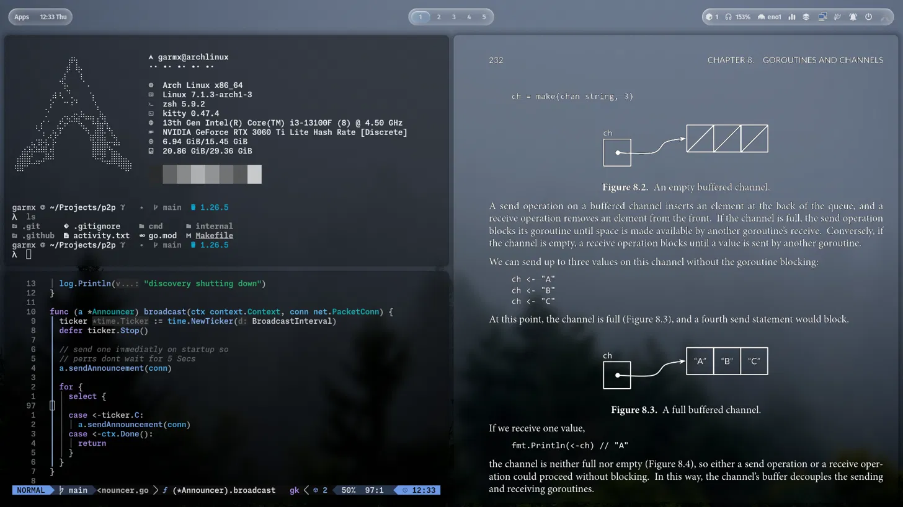
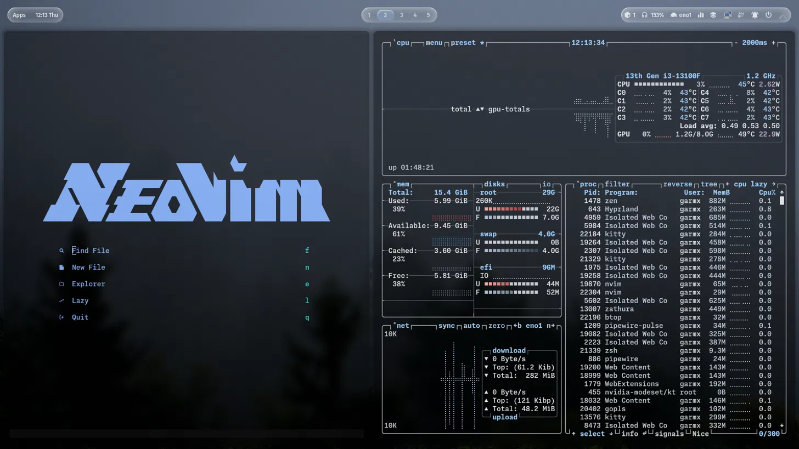

<div align="center">

# Garmx Dotfiles

**A personal Arch Linux desktop configuration built around Hyprland**

_Inspired by ML4W · Powered by LazyVim · Tuned for daily driving_

[](https://archlinux.org/)
[](https://hyprland.org/)
[](https://neovim.io/)
[](https://www.lazyvim.org/)

[](LICENSE)
[](https://github.com/garmxw/dotfiles/commits/main)
[](https://github.com/garmxw/dotfiles/stargazers)
[](https://github.com/garmxw/dotfiles/issues)

`dotfiles` · `hyprland` · `arch-linux` · `neovim` · `lazyvim` · `waybar` · `hyprlock` · `kitty` · `zsh` · `ml4w` · `rice`

</div>

---

## 📖 Overview

This repository contains my personal Hyprland desktop setup for Arch Linux. It's heavily inspired by the [ML4W Hyprland configuration](https://github.com/mylinuxforwork/dotfiles), with a number of personal customizations and workflow improvements layered on top. Rather than creating a separate ML4W preset, most changes live directly inside the `default.lua` preset.

The Neovim setup is built on [LazyVim](https://www.lazyvim.org/), extended with additional plugins, custom keymaps, and language support tailored to my day-to-day workflow (full-stack web dev, Go, and academic coursework).

> 💙 Huge thanks to the **ML4W** team for their outstanding Hyprland configuration, and to the **LazyVim** team for an excellent Neovim foundation.

---

## 🖼️ Screenshots

<table>
<tr>
<td width="50%">

**Workspace 1 — Terminal & Development**

`fastfetch` system info alongside a Neovim session editing Go code (P2P networking project), with a reference book split open for context.

</td>
<td width="50%">

**Workspace 2 — System Monitor & Neovim Dashboard**

The Neovim start dashboard next to `btop`, showing live CPU, memory, disk, process, and network stats.

</td>
</tr>
<tr>
<td width="50%">

**Workspace 3 — Browsing**

Side-by-side browser windows for quick reference and multitasking.

</td>
<td width="50%">

**Lock Screen — Hyprlock**

A minimal `hyprlock` screen with clock, date, avatar, and password prompt over a custom wallpaper.

</td>
</tr>
</table>

> All screenshots live in the [`screenshots/`](screenshots) directory.

---

## 📁 Repository Structure

```
.
├── .bashrc
├── .zshrc
├── assets/
├── fastfetch/
├── hypr/
├── kitty/
├── nvim/
├── ohmyposh/
├── packages/
├── screenshots/
├── waybar/
└── zathura/
```

| Directory / File | Description                                                        |
| ---------------- | ------------------------------------------------------------------ |
| `assets/`        | Arch Linux logos, ML4W logos, custom logos, and ASCII art variants |
| `fastfetch/`     | System info fetch tool configuration                               |
| `hypr/`          | Hyprland, Hyprlock, and Hypridle configuration                     |
| `kitty/`         | Kitty terminal emulator configuration                              |
| `nvim/`          | LazyVim-based Neovim configuration                                 |
| `ohmyposh/`      | Shell prompt theming                                               |
| `packages/`      | Optional package lists (`pacman.txt`, `yay.txt`)                   |
| `screenshots/`   | Desktop screenshots showcased in this README                       |
| `waybar/`        | Status bar configuration                                           |
| `zathura/`       | PDF viewer configuration                                           |

---

## 🎨 `assets/`

Contains:

- Original Arch Linux logos
- ML4W logos
- Multiple logo formats (ASCII, PNG, etc.)
- A custom Arch Linux logo

Copy this folder to:

```bash
~/.local/share/ascii/
```

> The installer does this automatically.

---

## 🪟 `hypr/`

Contains the configuration for:

- **Hyprland** — the compositor
- **Hyprlock** — the lock screen
- **Hypridle** — idle management

The original ML4W configuration files are kept as `.bak` files for reference only, e.g.:

- `hyprlock.conf.bak`
- `hypridle.conf.bak`

All custom configuration lives in `default.lua` — no additional ML4W preset is used.

---

## ⌨️ `nvim/`

Based on **LazyVim**, extended with personal plugins, keymaps, and language tooling.

---

## 📦 `packages/`

Contains:

- `pacman.txt`
- `yay.txt`

These package lists are optional and only installed when explicitly requested via the installer.

---

## 🚀 Installation

**1. Clone the repository**

```bash
git clone https://github.com/garmxw/dotfiles.git
cd dotfiles
```

**2. Make the installer executable**

```bash
chmod +x install.sh
```

**3. Install just the configuration**

```bash
./install.sh
```

**4. Install configuration and packages**

```bash
./install.sh --packages
```

**5. Specify the shell configuration manually**

```bash
./install.sh --shell zsh
# or
./install.sh --shell bash
```

**6. Combine both options**

```bash
./install.sh --packages --shell zsh
```

> If no shell is specified, the installer automatically detects your current shell and installs the matching configuration.

### What the installer does

- ✅ Creates the required directories
- ✅ Installs the configuration files
- ✅ Copies assets to `~/.local/share/ascii/`
- ✅ Installs `.zshrc` or `.bashrc`
- ✅ Optionally installs packages from `packages/pacman.txt` and `packages/yay.txt`

---

## Credits

Special thanks to:

- **[ML4W](https://github.com/mylinuxforwork/dotfiles)** — for the Hyprland configuration and desktop framework that inspired this setup
- **[LazyVim](https://www.lazyvim.org/)** and its contributors — for the Neovim foundation

---

<div align="center">

Made by [garmx](https://github.com/garmxw)

</div>
